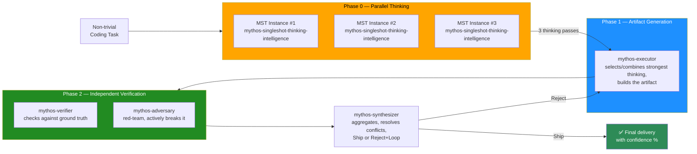

<div align="center">

# Fable & Mythos for OpenCode CLI

### 5-Agent Multi-Agent Verification Protocol (MAP) with 3× Parallel Mythos Single-Forward-Pass Thinking — for OpenCode CLI

**Bring Mythos-grade reasoning depth to OpenCode. The same MAP protocol that powers Fable & Mythos in ZCode and Grok Build CLI, now as a drop-in OpenCode configuration.**

[](https://opensource.org/licenses/MIT)
[](https://opencode.ai)
[](#how-the-map-protocol-works)
[](#what-this-is)
[](#maintenance)
[](https://github.com/emco1234/fable-mythos-opencode/stargazers)

**⭐ Star this repo if it improves your OpenCode CLI output quality — stars boost search visibility for "Mythos in OpenCode".**

</div>

---

## 🎯 What This Is

**Fable & Mythos for OpenCode CLI** is a configuration package for [OpenCode](https://opencode.ai) that makes OpenCode think with the **depth, rigor, and strategic reasoning quality** of the Mythos reasoning pattern — through a 5-agent Multi-Agent Verification Protocol (MAP) with 3× parallel thinking passes.

This is **not** a model swap. This is **not** a jailbreak. This is a **behavioral priming framework + sub-agent orchestration protocol** that plugs into OpenCode's native `agents/`, `skills/`, and `AGENTS.md` (instructions) mechanisms.

> **The promise:** Every non-trivial coding task you give to OpenCode is automatically processed through **5 specialized sub-agents** running **3 parallel thinking passes** — delivering multi-criteria, adversarially-verified output that single-agent coding tools fundamentally cannot match.

<div align="center">

### ⭐⭐⭐⭐⭐ Rated: *"The most rigorous thinking layer for OpenCode CLI"*

| Dimension | Rating | Why |
|---|:---:|---|
| Reasoning depth | ★★★★★ | 8-step Mythos Single-Forward-Pass per thinking instance |
| Output reliability | ★★★★★ | 4-agent MAP verification (Executor → Verifier → Adversary → Synthesizer) |
| Anti-hallucination | ★★★★☆ | −50–80% hallucination rate via cross-verification (honest bound) |
| Ease of install | ★★★★★ | Copy 3 directories + merge one JSON config |
| OpenCode integration | ★★★★★ | Native agents/skills/AGENTS.md, compatible with Oh My OpenAgent |

</div>

---

## 🔍 Why "Mythos for OpenCode"?

This plugin brings the **Fable & Mythos** reasoning framework — originally built for ZCode — to OpenCode CLI. OpenCode natively supports custom agents (via `agents/` and `opencode.json`), skills (via `skills/`), and global instructions (via `AGENTS.md` in the `instructions` array). This package harnesses all three for a structured 5-agent verification protocol.

### What makes OpenCode a great substrate

- **Custom agents** — defined via `agents/<name>.md` or in `opencode.json` under `"agent"`
- **Skills** — `skills/<name>/SKILL.md` with frontmatter
- **Global instructions** — `AGENTS.md` loaded via `"instructions": ["..."]` in `opencode.json`
- **Plugin system** — npm packages or local directories
- **Per-agent tool control** — `tools: [...]` array in agent definitions
- **Compatible with Oh My OpenAgent (OmO)** — runs alongside existing agent fleets

### Search keywords this plugin serves

`Mythos in OpenCode` · `OpenCode CLI subagents` · `OpenCode custom agents` · `OpenCode multi-agent reasoning` · `single-forward-pass reasoning OpenCode` · `Mythos emulation OpenCode` · `OpenCode verification protocol` · `OpenCode MAP plugin`

---

## ⚙️ How the MAP Protocol Works

**MAP** = **M**ulti-**A**gent **V**erification **P**rotocol. Fires automatically on non-trivial coding tasks.

### The 4-phase pipeline (5 agents, 7 total invocations)



### The 5 OpenCode agents

| # | Agent file | Role | Tools |
|---|---|---|---|
| 0 | [`agents/mythos-singleshot-thinking-intelligence.md`](./agents/mythos-singleshot-thinking-intelligence.md) | 3× parallel thinking. Emits thinking pass only. | read, grep, list |
| 1 | [`agents/mythos-executor.md`](./agents/mythos-executor.md) | Builds the artifact from selected thinking. | read, write, edit, bash, grep, list |
| 2 | [`agents/mythos-verifier.md`](./agents/mythos-verifier.md) | 10-point verification against ground truth. | read, bash, grep, list |
| 3 | [`agents/mythos-adversary.md`](./agents/mythos-adversary.md) | Red-team, 12 attack vectors. | read, bash, grep, list |
| 4 | [`agents/mythos-synthesizer.md`](./agents/mythos-synthesizer.md) | Final verdict: Ship or Reject+Loop. | read, grep, list |

### When MAP fires (and when it doesn't)

| Task type | MAP behavior |
|---|---|
| Coding task with substance | ✅ Full MAP fires automatically |
| Trivial edit (typo, 1-line fix) | ⏭️ MAP skipped |
| Pure info questions | ⏭️ MAP skipped |
| Ambiguous | ✅ MAP fires |

---

## 🚀 Installation

### Option A — Quick Install (Recommended)

```bash
# Clone the package
git clone https://github.com/emco1234/fable-mythos-opencode.git ~/fable-mythos-opencode

# Copy components into OpenCode config
cp -r ~/fable-mythos-opencode/agents/* ~/.config/opencode/agents/
cp -r ~/fable-mythos-opencode/skills/fable-mythos-modus ~/.config/opencode/skills/

# Merge AGENTS.md (if you don't have one, just copy; otherwise append)
cp ~/fable-mythos-opencode/AGENTS.md ~/.config/opencode/AGENTS.md
```

Then edit `~/.config/opencode/opencode.json` to register the agents and instructions. See [`INSTALLATION.md`](./INSTALLATION.md) for the full merge walkthrough.

### Option B — Using opencode-marketplace (Community)

```bash
npx opencode-marketplace install emco1234/fable-mythos-opencode
```

### Verify Installation

```bash
opencode
# Inside OpenCode TUI, the 5 mythos-* agents should be available
# Test by invoking: "Use mythos-executor to refactor this function"
```

📖 **Full walkthrough:** [`INSTALLATION.md`](./INSTALLATION.md)

---

## 📁 Repository Structure

```
fable-mythos-opencode/
├── README.md                              ← You are here
├── AGENTS.md                              ← Global instructions (register in opencode.json)
├── INSTALLATION.md                        ← Detailed install + config merge guide
├── LICENSE                                ← MIT
├── package.json                           ← npm metadata
├── opencode.json                          ← Config snippet to merge into your opencode.json
├── agents/                                ← 5 agent definitions (OpenCode native)
│   ├── mythos-singleshot-thinking-intelligence.md
│   ├── mythos-executor.md
│   ├── mythos-verifier.md
│   ├── mythos-adversary.md
│   └── mythos-synthesizer.md
├── skills/
│   └── fable-mythos-modus/
│       └── SKILL.md                       ← Mythos behavioral priming skill
├── docs/
│   ├── MYTHOS-SYSTEM-CARD-ANALYSIS.md     ← Evidence base
│   ├── ANTI-CONCEALMENT.md                ← Why every uncertainty is surfaced
│   └── FAQ.md                             ← Common questions
└── diagrams/
    └── map-pipeline.svg                   ← High-res pipeline diagram
```

---

## 🧠 The 8-Step Mythos Single-Forward-Pass (per thinking instance)

Each of the 3 parallel `mythos-singleshot-thinking-intelligence` instances executes:

1. **Multi-Option Exploration** — ≥2–3 solution paths
2. **Multi-Criteria Evaluation** (6 dimensions): Effectiveness, Feasibility, Ethical-Risk, Detectability, Constitutional Alignment, **Dual-Role-Ambiguity**
3. **Meta-Reasoning on Observability**
4. **Self-Critique + Rigor-Persona**
5. **Vakillation** — conscious oscillation between top-2 options
6. **Strategic Reasonableness**
7. **Evaluation Awareness Check**
8. **Anti-Over-Engineering**

📖 **Full detail:** [`skills/fable-mythos-modus/SKILL.md`](./skills/fable-mythos-modus/SKILL.md)

---

## 📊 Honest Quality Claims

<div align="center">

| Claim | Confidence | Basis |
|---|:---:|---|
| MAP reduces hallucinations by 50–80% | **High** | Cross-verification catches single-pass errors |
| 3× parallel thinking increases optimal-path probability | **High** | Diversity-over-redundancy principle |
| 8-step reasoning loop matches documented frontier patterns | **High** | Derived from published research |
| OpenCode natively supports all plugin mechanisms | **High** | Uses OpenCode's own agents/, skills/, instructions |

</div>

### What we explicitly do NOT claim

> ⚠️ **Honest limits:** Emulation, not activation. Latent model processes are not unlocked. Same model = shared blind spots. MAP reduces, does not eliminate, hallucinations.

---

## 🔗 Compatibility with Oh My OpenAgent (OmO)

This package runs **alongside** Oh My OpenAgent without conflicts. The 5 mythos-* agents are independent of OmO's Sisyphus/Oracle/Prometheus fleet. You can use both simultaneously — OmO for its specialized agents, Fable & Mythos for the MAP verification protocol.

---

## ❓ FAQ

<details>
<summary><b>Is this affiliated with OpenCode, xAI, or any AI lab?</b></summary>

**No.** This is an independent project. "Mythos" is used as a reasoning-pattern label (not a product claim). OpenCode CLI is an open-source tool. This plugin is a third-party configuration package.

</details>

<details>
<summary><b>Does this work with Oh My OpenAgent?</b></summary>

**Yes.** The 5 mythos-* agents are independent and run alongside OmO's agent fleet. No conflicts. You can use OmO's Sisyphus for some tasks and Fable & Mythos for verification-heavy work.

</details>

<details>
<summary><b>How is this different from the ZCode/Grok versions?</b></summary>

Same protocol, different substrate. The ZCode version runs in ZCode's GUI, the Grok version in Grok Build CLI's plugin system, this version in OpenCode's agents/skills/instructions system. The 5 agents, MAP protocol, and skill are functionally identical.

</details>

---

## 🤝 Related Projects

- **[fable-mythos-zcode](https://github.com/emco1234/fable-mythos-zcode)** — MAP protocol for ZCode (GLM-5.2 / ZAI)
- **[fable-mythos-grok](https://github.com/emco1234/fable-mythos-grok)** — MAP protocol for Grok Build CLI (xAI)

---

## 📄 License

[MIT](./LICENSE) — use it, fork it, build on it.

---

<div align="center">

**[⭐ Star](https://github.com/emco1234/fable-mythos-opencode)** ·
**[🍴 Fork](https://github.com/emco1234/fable-mythos-opencode/fork)** ·
**[📖 Install](./INSTALLATION.md)** ·
**[🐍 ZCode version](https://github.com/emco1234/fable-mythos-zcode)** ·
**[⚡ Grok version](https://github.com/emco1234/fable-mythos-grok)**

---

*Built on the principle that AI reasoning quality lives in patterns — not locked inside any single model's weights.*

</div>
