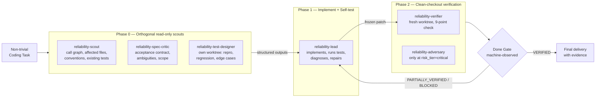

<div align="center">

# Fable & Mythos for OpenCode CLI

### Mythos-Inspired Reliability Harness — orthogonal scouts, self-testing lead, clean-checkout verifier, deterministic Done Gate.

**A configuration bundle for OpenCode that applies observable, evidence-based reasoning patterns derived from published frontier-model research. Not a model swap, not a jailbreak, not a 1:1 emulation.**

[](https://opensource.org/licenses/MIT)
[](https://opencode.ai)
[](#honest-quality-claims)

**Star this repo if you want to follow the empirical validation work.**

</div>

---

## What This Is

**Fable & Mythos for OpenCode CLI** is a configuration package for [OpenCode](https://opencode.ai) that applies **observable, evidence-based reasoning patterns** (multi-option exploration, multi-criteria evaluation, auditability, strategic reasonableness) through a multi-agent reliability harness with a deterministic Done Gate.

This is **not** a model swap. This is **not** a jailbreak. This is **not** a 1:1 emulation of any other model. It is a **behavioral priming framework + sub-agent orchestration protocol** that plugs into OpenCode's native `agents/`, `skills/`, and `AGENTS.md` (instructions) mechanisms.

> **The hypothesis:** Independent, evidence-based verification improves reliability. Every non-trivial coding task is processed through specialized sub-agents — orthogonal read-only scouts, a self-testing lead engineer, and a clean-checkout verifier — ending in a deterministic, machine-observed Done Gate. Empirical validation against a GLM-5.2 baseline is planned, not yet measured.

<div align="center">

### Unrated — empirical validation pending

| Dimension | Status | Note |
|---|---|---|
| Reasoning depth | Unrated | Multi-option + multi-criteria evaluation per agent |
| Output reliability | Unrated | Clean-checkout verification + Done Gate |
| Anti-hallucination | Unrated | Hypothesis only; benchmark pending |
| Ease of install | Unrated | Copy 3 directories + managed-block merge |
| OpenCode integration | Unrated | Native agents/skills/AGENTS.md; compatible with OmO |

</div>

---

## Why "Mythos-Inspired for OpenCode"?

This package brings a **reliability harness** inspired by published frontier-model reasoning research to OpenCode CLI. OpenCode natively supports custom agents (via `agents/`), skills (via `skills/`), and global instructions (via `AGENTS.md`). This package uses all three for a structured multi-agent verification protocol.

### What makes OpenCode a great substrate

- **Custom agents** — auto-discovered from `agents/<name>.md` (frontmatter: `name`, `description`, `mode`, `tools`).
- **Skills** — `skills/<name>/SKILL.md` with frontmatter; loaded on demand via the Skill tool.
- **Global instructions** — `AGENTS.md` loaded via OpenCode's auto-discovery (and optionally via `"instructions": ["..."]`).
- **Per-agent tool control** — `tools: [...]` list in agent frontmatter (least privilege).

### Search keywords this package serves

`Mythos-inspired OpenCode` · `OpenCode CLI subagents` · `OpenCode custom agents` · `OpenCode multi-agent reasoning` · `OpenCode reliability harness` · `OpenCode verification protocol` · `Done Gate` · `clean-checkout verifier`

---

## How the Reliability Harness Works

**MAP** = **M**ulti-**A**gent **V**erification **P**rotocol. Fires automatically on non-trivial coding tasks, with **dynamic routing** by risk tier (see `core/routing.md`).

### Dynamic routing (no fixed 7-agent fleet on every task)

| Risk tier | Agents engaged |
|---|---|
| trivial | Main agent alone |
| normal | Main agent + clean-checkout verifier |
| complex | Orthogonal read-only scouts (parallel) → Lead (implements + self-tests) → Verifier |
| critical | complex + Adversary in isolated worktree |

The legacy 3× parallel identical-thinking fleet is kept as an optional fallback but is **not** the default — three orthogonal scouts produce real diversity (codebase / spec / verification) rather than stylistic variants of the same assumption.

### The reliability pipeline (complex task)



### The agents

| # | Agent file | Role | Tools |
|---|---|---|---|
| 0 (legacy) | [`agents/mythos-singleshot-thinking-intelligence.md`](./agents/mythos-singleshot-thinking-intelligence.md) | Optional parallel thinking. Emits thinking pass only. | read, grep, glob |
| 1 (legacy) | [`agents/mythos-executor.md`](./agents/mythos-executor.md) | Builds artifact + self-tests. | read, edit, write, bash, grep, glob |
| 2 (legacy) | [`agents/mythos-verifier.md`](./agents/mythos-verifier.md) | 9-point verification on clean checkout. | read, bash, grep, glob |
| 3 (legacy) | [`agents/mythos-adversary.md`](./agents/mythos-adversary.md) | Red-team, 12 attack vectors. | read, bash, grep, glob |
| 4 (legacy) | [`agents/mythos-synthesizer.md`](./agents/mythos-synthesizer.md) | Aggregates findings (recommendation only; Done Gate decides). | read, grep, glob |
| 5 | [`agents/reliability-scout.md`](./agents/reliability-scout.md) | Call graph, affected files, conventions, existing tests. | read, grep, glob |
| 6 | [`agents/reliability-spec-critic.md`](./agents/reliability-spec-critic.md) | Acceptance contract, ambiguities, scope, invariants. | read, grep, glob |
| 7 | [`agents/reliability-test-designer.md`](./agents/reliability-test-designer.md) | Repro, regression, edge cases (own worktree). | read, edit, write, bash, grep, glob |
| 8 | [`agents/reliability-lead.md`](./agents/reliability-lead.md) | Implements + self-tests (Lead Engineer standard). | read, edit, write, bash, grep, glob |
| 9 | [`agents/reliability-verifier.md`](./agents/reliability-verifier.md) | Clean-checkout verification, 9-point check. | read, bash, grep, glob |
| 10 | [`agents/reliability-adversary.md`](./agents/reliability-adversary.md) | Only at `risk_tier=critical`: fuzzing, race/security probes. | read, bash, grep, glob |

### When the harness fires (and when it doesn't)

| Task type | Behavior |
|---|---|
| Coding task with substance | Full harness fires automatically (risk-tier routed) |
| Trivial edit (typo, 1-line fix) | Skipped |
| Pure info questions | Skipped |
| Ambiguous | Fires |

---

## Installation

### Option A — Quick Install (Recommended)

```bash
# Clone the package
git clone https://github.com/emco1234/fable-mythos-opencode.git ~/fable-mythos-opencode

# Copy components into OpenCode config
cp -r ~/fable-mythos-opencode/agents/* ~/.config/opencode/agents/
cp -r ~/fable-mythos-opencode/skills/fable-mythos-modus ~/.config/opencode/skills/

# Merge AGENTS.md using the idempotent managed-block installer
# (see INSTALLATION.md Step 3 for the full idempotent script)
```

Then edit `~/.config/opencode/opencode.json` to set permissions. See [`INSTALLATION.md`](./INSTALLATION.md) for the full merge walkthrough (including the idempotent managed-block installer).

### Verify Installation

```bash
opencode
# Inside OpenCode TUI, the agents should be auto-discovered
# Test by invoking: "Use reliability-lead to refactor this function"
```

Full walkthrough: [`INSTALLATION.md`](./INSTALLATION.md)

---

## Repository Structure

```
fable-mythos-opencode/
├── README.md                              ← You are here
├── AGENTS.md                              ← Global rules (managed-block install)
├── INSTALLATION.md                        ← Detailed install + idempotent merge guide
├── LICENSE                                ← MIT
├── package.json                           ← Project metadata (configuration bundle, not an npm plugin)
├── opencode.json                          ← Config snippet to merge into your opencode.json
├── agents/                                ← Agent definitions (OpenCode auto-discovery)
│   ├── mythos-singleshot-thinking-intelligence.md   (legacy / fallback)
│   ├── mythos-executor.md                            (legacy)
│   ├── mythos-verifier.md                            (legacy)
│   ├── mythos-adversary.md                           (legacy)
│   ├── mythos-synthesizer.md                         (legacy)
│   ├── reliability-scout.md
│   ├── reliability-spec-critic.md
│   ├── reliability-test-designer.md
│   ├── reliability-lead.md
│   ├── reliability-verifier.md
│   └── reliability-adversary.md
├── core/                                  ← Schemas + runtime rules
│   ├── runtime-rules.md
│   ├── routing.md
│   ├── evidence-ledger.md
│   ├── task-contract.schema.json
│   └── verification-report.schema.json
├── skills/
│   └── fable-mythos-modus/
│       └── SKILL.md                       ← Behavioral priming skill
├── docs/
│   ├── MYTHOS-SYSTEM-CARD-ANALYSIS.md     ← Evidence base
│   ├── ANTI-CONCEALMENT.md                ← Why every uncertainty is surfaced
│   ├── FAQ.md                             ← Common questions
│   ├── RELIABILITY-ROADMAP.md             ← P2/P3 goals
│   └── EMPIRICAL-BENCHMARK-PLAN.md        ← Validation plan
└── diagrams/
    └── map-pipeline.svg                   ← High-res pipeline diagram
```

---

## Honest Quality Claims

<div align="center">

| Claim | Confidence | Basis |
|---|:---:|---|
| The harness enforces a deterministic Done Gate | **High** | Defined in `core/runtime-rules.md`; machine-observed |
| Orthogonal scouts produce more diversity than 3 identical clones | **Medium** | Established ensemble principle; not yet measured here |
| Self-testing + clean-checkout verification is structurally stronger than self-exemption | **Medium** | Aligns with published multi-agent findings |
| Empirical improvement over a GLM-5.2 baseline | **Unproven** | Benchmark planned, not yet run — see `docs/EMPIRICAL-BENCHMARK-PLAN.md` |

</div>

### What we explicitly do NOT claim

> **Honest limits:** This is *Mythos-inspired*, not *Mythos-identical*. Prompts can steer behavior; they do not move weights, post-training, or latent representations. Same model = shared blind spots. The harness reduces, does not eliminate, correlated errors. Empirical validation is planned, not yet measured. Anyone claiming "100% Mythos", "1:1", "MAP-v2", "Cybench 100%", "−50–80% hallucination rate", or "★★★★★ output reliability" on this package is misrepresenting it.

---

## Compatibility with Oh My OpenAgent (OmO)

This package runs **alongside** Oh My OpenAgent without conflicts. The agents are independent of OmO's Sisyphus/Oracle/Prometheus fleet. You can use both simultaneously — OmO for its specialized agents, Fable & Mythos for the reliability harness.

---

## FAQ

<details>
<summary><b>Is this affiliated with OpenCode, xAI, ZAI, or any AI lab?</b></summary>

**No.** This is an independent project. "Mythos" is used as a reasoning-pattern label (not a product claim). OpenCode CLI is an open-source tool. This package is a third-party configuration bundle.

</details>

<details>
<summary><b>Does this work with Oh My OpenAgent?</b></summary>

**Yes.** The agents are independent and run alongside OmO's agent fleet. No conflicts.

</details>

<details>
<summary><b>Does this make OpenCode identical to another model?</b></summary>

**No, and we don't claim it will.** Observable behavioral patterns transfer. Latent internal processes (SAE features, evaluation-awareness vectors, emotion/persona vectors) are architecture-specific to other models' weights and do not transfer. Net result: a structurally stronger reliability harness, not model parity.

</details>

<details>
<summary><b>Where are the empirical numbers?</b></summary>

**Planned, not yet measured.** See [`docs/EMPIRICAL-BENCHMARK-PLAN.md`](./docs/EMPIRICAL-BENCHMARK-PLAN.md) for the four-variant comparison plan (GLM-5.2 baseline / current harness / compact prompt / harness v2) with the metrics that matter (false_done_rate is the most important).

</details>

---

## Related Projects

- **[fable-mythos-zcode](https://github.com/emco1234/fable-mythos-zcode)** — Companion package for ZCode (GLM-5.2 / ZAI)
- **[fable-mythos-grok](https://github.com/emco1234/fable-mythos-grok)** — Companion package for Grok Build CLI (xAI)

---

## License

[MIT](./LICENSE) — use it, fork it, build on it.

---

<div align="center">

**[Star](https://github.com/emco1234/fable-mythos-opencode)** ·
**[Fork](https://github.com/emco1234/fable-mythos-opencode/fork)** ·
**[Install](./INSTALLATION.md)** ·
**[Roadmap](./docs/RELIABILITY-ROADMAP.md)** ·
**[Benchmark plan](./docs/EMPIRICAL-BENCHMARK-PLAN.md)**

---

*Built on the principle that reliability comes from evidence, orthogonal verification, and machine-observed gates — not from pretending a prompt moves weights.*

</div>
